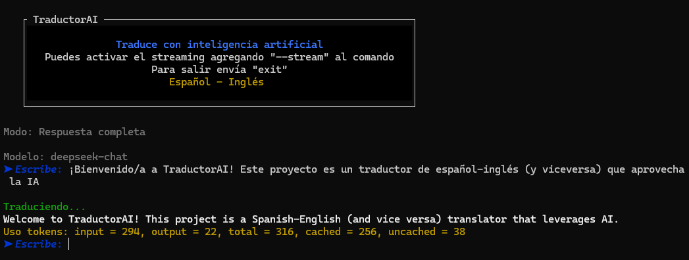
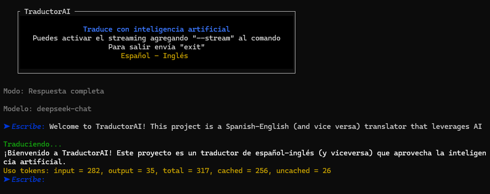

# TraductorAI terminal

¡Bienvenido/a a **TraductorAI**! Este proyecto es un traductor de español-inglés (y viceversa) que aprovecha la inteligencia artificial para traducciones mas naturales.  

Utiliza el sdk de OpenAI por lo que puedes usar sus modelos (y también es compatible con modelos de [Deepseek](https://deepseek.com/)) para ofrecer traducciones rápidas y fluidas. Además, incluye la opción de procesar la respuesta en modo de _streaming_.

> [!NOTE]
> **No necesitas indicar el idioma de origen, ya que el sistema lo detecta automáticamente.**

## Vista previa de la aplicación

Aquí hay un par de ejemplos que ilustran la traducción de español a inglés y viceversa. ¡Sustituye estas imágenes con tus propias capturas de pantalla!

| Español a Inglés                            | Inglés a Español                           |
| ------------------------------------------- | ------------------------------------------ |
|  |  |

## Características principales

- **Modo streaming**: Opción para mostrar la respuesta progresivamente.
- **Traducciones contextuales**: El sistema considera expresiones coloquiales y dobles sentidos.
- **Integración flexible**: Además de [OpenAI](https://openai.com/), también se puede configurar con modelos de [Deepseek](https://deepseek.com/) siempre que la API sea compatible.
- **Uso de variables de entorno**: Controla tu propia configuración con `.env`.
- **Soporte para Node >= 18**: Se utiliza `--watch` para recargar en tiempo real, lo cual requiere versiones más recientes de Node.

## Requisitos de instalación

1. **Node.js** v18 o superior (importante para soportar `--watch`).
2. **npm**, **pnpm** o **yarn** (el proyecto incluye un `pnpm-lock.yaml`).
3. Archivo `.env` con las siguientes variables:
   ```env
   BASE_URL="<tu_base_url>"       # URL base del proveedor (OpenAI, Deepseek, etc.)
   API_KEY="<tu_api_key>"         # Tu clave de API correspondiente
   MODEL="deepseek-chat"          # o el modelo que prefieras (OpenAI o Deepseek)
   ```

## Pasos para empezar

1. **Clonar el repositorio**:

   ```bash
   git clone https://github.com/Javiervinus/terminal-translator-ai.git
   cd terminal-translator-ai
   ```

2. **Instalar dependencias**:

   ```bash
   # Usando PNPM
   pnpm install

   # O usando NPM
   npm install

   # O usando Yarn
   yarn install
   ```

3. **Configurar variables de entorno**:

   - Crea un archivo `.env` en la raíz del proyecto con tus credenciales de OpenAI o Deepseek y la URL base.

4. **Ejecutar la aplicación**:
   - Modo estándar:
     ```bash
     pnpm start
     ```      
     Ingresa tu texto y verás la traducción completa.
   - Modo streaming:
     ```bash
      pnpm start --stream
     ```
     Verás la traducción aparecer progresivamente.
   - Modo desarrollo con recarga:
     ```bash
      pnpm dev
     ```
     El script se recargará automáticamente con cambios en el código, aprovechando la opción `--watch`.

## Uso

1. **Escribe tu texto** cuando se te solicite en la terminal.
2. **Observa la traducción** en español o inglés.
3. **Envía "exit"** para cerrar la aplicación.

## Ejemplo de ejecución

```plaintext
$ pnpm start

TraductorAI
Modo: Respuesta completa
Modelo: gpt-4o

➤ Escribe: Hola, ¿cómo estás?
Traduciendo...
How are you?

Uso tokens: input = 15, output = 7, total = 22, ...
```

## Personalización

- Puedes ajustar la temperatura y otros parámetros en el archivo principal (`index.mjs`) para afinar la creatividad de la traducción.
- Modifica el arreglo `SYSTEM_MESSAGES` para personalizar el estilo y el tono de las traducciones.

## Contribución

¡Se aceptan contribuciones! Siéntete libre de hacer _fork_, proponer mejoras y enviar _pull requests_.

## Licencia

Este proyecto está disponible bajo la [MIT License](./LICENSE). ¡Disfruta y traduce responsablemente!

---

¡Gracias por usar **TraductorAI**! Si tienes preguntas o sugerencias, no dudes en abrir un _issue_.
